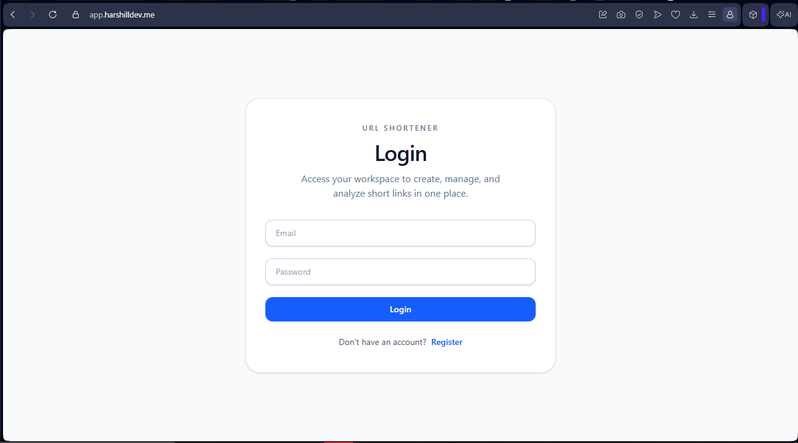
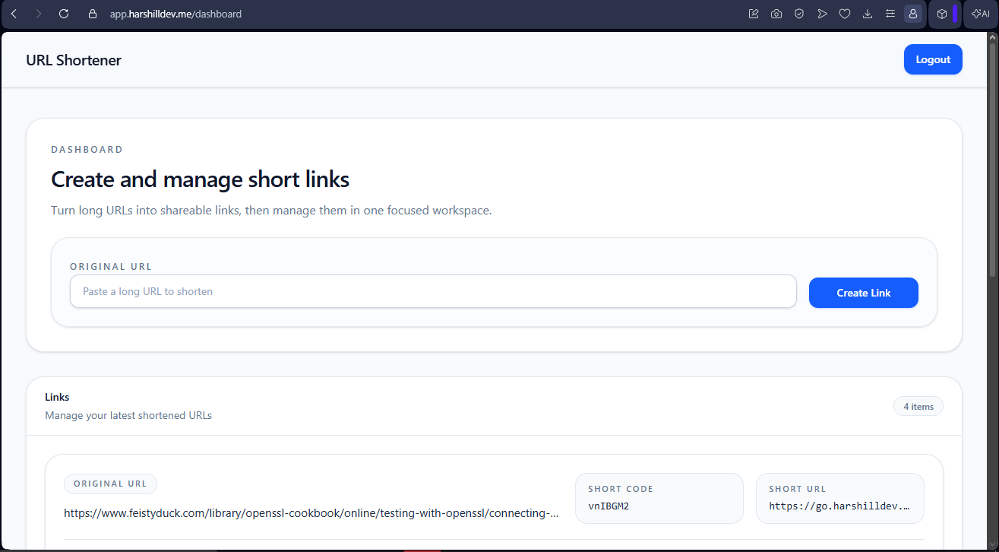
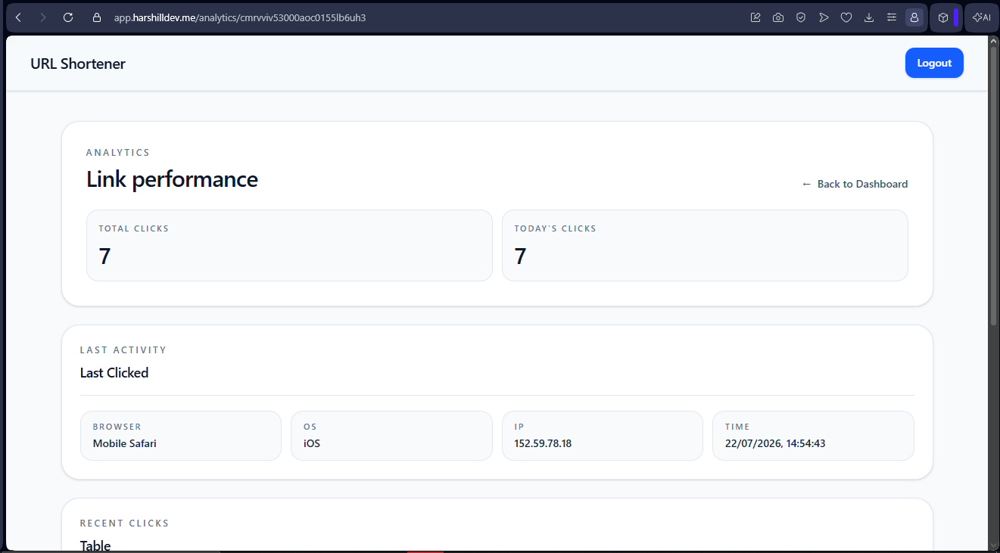
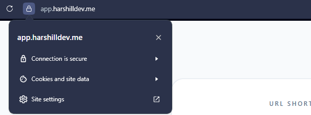
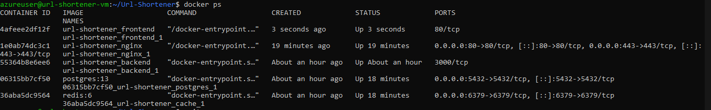

# LinkForge v1

[](https://github.com/harshillvashisht/Url-Shortener/releases/tag/v1.0.0)
[](https://app.harshilldev.me)
[](https://go.harshilldev.me)

> **Note:** The application is deployed on an Azure Virtual Machine, but the VM may be intentionally shut down at times to save cloud costs. The source code, Docker configuration, Nginx setup, and HTTPS deployment are fully available in this repository.

A production-ready URL Shortener built with **Node.js, Express, PostgreSQL, Redis, React, and Docker**. This project allows authenticated users to create short links, track analytics, and manage their URLs through a secure dashboard.

## Live Demo

* **Frontend:** https://app.harshilldev.me
* **Short URLs:** https://go.harshilldev.me

## v1 Features

* User authentication with JWT stored in **HTTP-only cookies**
* Create and manage shortened URLs
* Custom short code generation
* Secure redirects using HTTPS
* Click analytics tracking
* Redis-based rate limiting
* Dockerized backend, frontend, PostgreSQL, and Redis
* Nginx reverse proxy with Let's Encrypt SSL

## Tech Stack

### Frontend

* React
* TypeScript
* Vite
* Tailwind CSS
* React Router
* Axios

### Backend

* Node.js
* Express
* TypeScript
* PostgreSQL
* Prisma ORM
* Redis
* JWT Authentication

### DevOps & Deployment

* Docker
* Docker Compose
* Nginx
* Let's Encrypt SSL
* Azure Virtual Machine

## Architecture

```text
User
   ↓
Nginx Reverse Proxy (HTTPS)
   ├── Frontend (React)
   └── Backend API (Express)
           ├── PostgreSQL
           └── Redis
```

## Folder Structure

```text
Url-Shortener/
├── backend/
│   ├── prisma/
│   │   ├── migrations/
│   │   └── schema.prisma
│   ├── src/
│   │   ├── features/
│   │   │   ├── analytics/
│   │   │   ├── auth/
│   │   │   └── links/
│   │   ├── infrastructure/
│   │   │   ├── cache/
│   │   │   ├── config/
│   │   │   ├── database/
│   │   │   └── logger/
│   │   ├── middleware/
│   │   ├── shared/
│   │   ├── app.ts
│   │   └── server.ts
│   ├── Dockerfile
│   └── package.json
├── frontend/
│   ├── src/
│   │   ├── api/
│   │   ├── components/
│   │   │   ├── auth/
│   │   │   ├── common/
│   │   │   └── links/
│   │   ├── contexts/
│   │   ├── hooks/
│   │   ├── pages/
│   │   ├── types/
│   │   └── config.ts
│   ├── Dockerfile
│   └── package.json
├── nginx/
│   ├── conf.d/
│   │   ├── app.conf
│   │   └── go.conf
│   ├── Dockerfile
│   └── nginx.conf
├── docs/
│   └── ScreenShots/
├── docker-compose.yml
└── README.md
```


## Screenshots

### Authentication



### Dashboard



### Analytics



### HTTPS Secure Connection



### Docker Containers



## API Endpoints

| Method | Endpoint                    | Description              |
| ------ | --------------------------- | ------------------------ |
| POST   | /api/v1/auth/register       | Register a new user      |
| POST   | /api/v1/auth/login          | Login user               |
| POST   | /api/v1/auth/logout         | Logout user              |
| GET    | /api/v1/auth/me             | Get current user         |
| POST   | /api/v1/links               | Create short link        |
| GET    | /api/v1/links               | Get user links           |
| DELETE | /api/v1/links/:id           | Delete a link            |
| GET    | /api/v1/links/:id/analytics | Get link analytics       |
| GET    | /:shortCode                 | Redirect to original URL |

## Local Development

```bash
git clone https://github.com/harshillvashisht/url-shortener.git
cd url-shortener
docker-compose up --build
```

## Environment Variables

Create a `backend/.env` file:

```env
DATABASE_URL=your_postgres_url
REDIS_URL=your_redis_url
JWT_SECRET=your_jwt_secret
BASE_URL=http://localhost
FRONTEND_URL=http://localhost:5173
```

Create a `frontend/.env` file:

```env
VITE_SHORT_BASE_URL=http://localhost:3000
VITE_API_BASE_URL=http://localhost:3000/api/v1
```

## Production Deployment

The application is deployed on an **Azure Virtual Machine** using:

* Docker Compose for container orchestration
* Nginx as a reverse proxy
* Let's Encrypt for SSL certificates
* PostgreSQL and Redis as Docker containers
* Separate subdomains for frontend and redirects

## What I Learned

* Building a full-stack application with React and Express
* Designing REST APIs with proper authentication
* Using PostgreSQL with Prisma ORM
* Implementing Redis-based rate limiting
* Dockerizing a multi-service application
* Configuring Nginx as a reverse proxy
* Deploying a production application with HTTPS on Azure

## Future Improvements (v2)

* Custom aliases for short URLs
* QR code generation
* Advanced analytics dashboard
* Link expiration options
* Team/shared link management

## Author

**Harshill**

Built as part of my full-stack development and DevOps learning journey.
